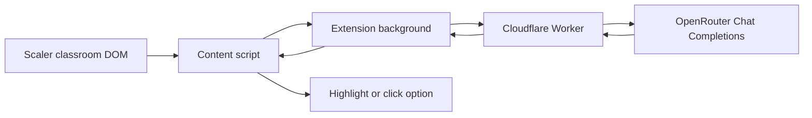

# Rin 🌸

Rin is a Manifest V3 browser extension that detects multiple-choice quizzes in Scaler's Drona classrooms, requests an answer through a Cloudflare Worker and OpenRouter, and highlights or clicks the recommended option.

- **Assisted mode (default):** adds a light purple background (`#e8d5f5`) and purple outline to the recommended choice. The student selects the answer.
- **Auto mode:** dispatches synthetic pointer and mouse events to the recommended choice. Submission depends on Scaler's event handling; Rin does not confirm that the platform accepted the answer.

Rin starts enabled. The popup controls enablement and execution mode, and storage changes update content scripts already running in open tabs. Enabling Rin during an existing quiz immediately rechecks it; answered quizzes are skipped.

## How it works



The content script runs at `document_idle` on Scaler pages, including matching frames. `MeetingWatcher` looks for `.m-activity`; until one appears it observes `#root`, falling back to `body`. Once a classroom is found, a quiz observer watches that container and a separate observer watches its parent for removal. Leaving the classroom cleans up the actor and quiz observer, then re-arms meeting detection.

Quiz extraction uses Scaler-specific CSS selectors to read question text and labeled options from `div.m-quiz`. It preserves question `<pre>` formatting and keeps option element references for highlighting or clicking. The observer suppresses duplicate emissions with the same quiz element and question text.

The background sends the question, options, and configured model to `https://rin-worker.pujankhunt.me/solve`. The worker requests JSON containing a choice from OpenRouter, matches the returned label to an option, and returns its index, label, model ID, and worker-side solver duration. The default model ID in the source is `deepseek/deepseek-v4-flash`; availability and answer accuracy are not verified by the automated suite. The extension aborts its worker request after five seconds.

## Repository layout

```text
packages/
├── extension/                  # WXT + Vite browser extension
│   ├── src/
│   │   ├── actors/             # HUD and synthetic click strategies, factory
│   │   ├── config/             # Settings defaults, storage, subscriptions
│   │   ├── diagnostics/        # Development DOM snapshots and hotkeys
│   │   ├── dom/                # Centralized selectors and DOM utilities
│   │   ├── entrypoints/        # Background, content script, HTML/CSS/TS popup
│   │   ├── meeting/            # Classroom mount and removal watcher
│   │   ├── messaging/          # Message contracts, routing, logging
│   │   ├── quiz/               # Extraction, observation, solve/act workflow
│   │   └── solver/             # Authenticated worker HTTP client
│   ├── tests/
│   └── public/icon/
├── worker/                     # Cloudflare Worker, OpenRouter client, parser
│   ├── src/
│   ├── tests/
│   └── wrangler.jsonc
└── shared/src/                 # QuizInput, QuizChoice, QuizOption, SolveResult
```

The repository also includes two captured live-class HTML files, Vitest configuration, and maintained [system](docs/superpowers/specs/2026-09-25-rin-design.md) and [extension](docs/superpowers/specs/2026-10-02-extension-architecture-refactor-design.md) implementation references. The original benchmark CLI and 17-fixture collection were proposals; they are absent from this checkout.

## Development setup

Use Node.js **22.23.2** and pnpm **12.6.0** to match the environment used for build verification. The installed WXT and Wrangler versions require Node.js 22 or newer. Wrangler is already a workspace development dependency.

```bash
git clone https://github.com/Pujan-khunt/Rin.git
cd Rin
pnpm install --frozen-lockfile
```

### Credentials

The worker needs two environment secrets:

| Name | Purpose |
|---|---|
| `OPENROUTER_API_KEY` | Authenticates the worker's upstream OpenRouter request. |
| `RIN_CLIENT_KEY` | Compared with the extension's `X-Rin-Client` header. |

For local worker development, create the ignored file `packages/worker/.dev.vars`:

```ini
OPENROUTER_API_KEY="your-openrouter-key"
RIN_CLIENT_KEY="your-client-key"
```

For a deployed worker, configure secrets from `packages/worker` using the workspace Wrangler installation:

```bash
cd packages/worker
pnpm exec wrangler secret put OPENROUTER_API_KEY
pnpm exec wrangler secret put RIN_CLIENT_KEY
```

Provide the matching client key when starting or building the extension:

```bash
export RIN_CLIENT_KEY="your-client-key"
```

WXT also accepts `VITE_RIN_CLIENT_KEY` as a fallback. Build and zip commands reject a missing key. Development does not have that build guard, but `WorkerClient` still throws during initialization without a key. The value is embedded in the extension bundle; it is not a private server credential. The OpenRouter API key belongs only on the worker.

### Extension commands

Run these commands from the repository root after exporting the client key:

```bash
pnpm --filter @rin/extension dev
pnpm --filter @rin/extension dev:firefox
pnpm build
pnpm --filter @rin/extension build:firefox
pnpm --filter @rin/extension zip
pnpm --filter @rin/extension zip:firefox
pnpm --filter @rin/extension zip:all
```

`pnpm build` builds the Chrome extension; the worker and shared packages have no `build` script. Extension artifacts go into `packages/extension/.output/`. See [BUILD.md](BUILD.md) for verified archive names and reviewer build instructions.

Load `packages/extension/.output/chrome-mv3` with **Load unpacked** from Chrome's extensions page in Developer mode. For Firefox, use **Load Temporary Add-on** in `about:debugging#/runtime/this-firefox` and select `packages/extension/.output/firefox-mv3/manifest.json`. The manifest declares Firefox 140.0 and Firefox Android 142.0 minimum versions; those declarations do not establish device test coverage.

### Worker commands

```bash
pnpm --filter @rin/worker dev
pnpm --filter @rin/worker deploy
```

The default local worker address is `http://localhost:8787`. The extension continues to use the production URL during development. Testing it against a local worker requires changing its default URL or passing a different URL to `WorkerClient`, plus a matching manifest host permission where needed.

Deployment uses the `rin-solver` worker and custom domain `rin-worker.pujankhunt.me` configured in `wrangler.jsonc`. Worker deployment is separate from extension builds. The configuration enables persisted invocation logs and traces with sampling rates of 1.

## Development-only features

- Recorded-player `.vp-container` detection is available alongside live-class detection.
- The popup exposes DeepSeek and Gemini model presets and a custom model ID. The background uses the stored model override in development. Production hides the model controls, but still sends the stored model through the quiz workflow.
- The logger forwards content/popup logs to the extension background console. Normal logger calls return without emitting in production.
- After a successful workflow action, quiz and application-root HTML snapshots are saved under `rinSnapshots` in local storage. Automatic recording does not download a file.
- `Alt+Shift+S` or `Ctrl+Alt+S` captures `#root` (or `body`), saves a snapshot, and downloads `rin-manual-snapshot-<timestamp>.html`. Storage failures are swallowed and snapshots have no retention cap.

## Data and authentication

The solver receives question text, option labels/text/indexes, and a model ID. DOM element references, raw HTML, and page URLs are not sent in solver requests. The worker sends question text and option labels/text to OpenRouter; the model's response is parsed for its choice, and reasoning is not exposed in the extension response. Development snapshots remain in browser local storage unless manually downloaded.

The extension requests `storage` permission and host permissions for Scaler and the production worker. The worker requires a present `Origin` beginning with `chrome-extension://`, `moz-extension://`, `http://localhost`, or `http://127.0.0.1`, plus the client key. These are prefix checks, not a specific extension ID allowlist or parsed hostname validation. There is no application-level rate limiting.

## Verification and current limits

```bash
pnpm test
pnpm typecheck
```

Vitest covers extraction, observers, actors, configuration, messaging, entrypoints, popup behavior, diagnostics, worker requests, and answer parsing. Tests use JSDOM and mocked browser/network APIs. They do not measure live inference accuracy or latency, or confirm live Scaler submissions. The captured HTML files are references; the extractor tests use inline fixtures.

Current behavior to account for:

- Hydration requires a nonempty question, at least one option, and at least one nonempty option text. It does not wait for every option to populate.
- Already-answered detection is captured before solving. After inference, the workflow checks enablement and quiz connectivity, but does not reread the selected choice, countdown, or question identity.
- Duplicate suppression ignores option-only changes. A failed solve is not automatically retried for the same quiz element and question.
- Meeting removal observation is usually shallow on the classroom's immediate parent; removing a more distant ancestor can bypass that observer.
- Settings are mutable references. Although `save()` replaces its cache only after a successful write, callers such as the popup can mutate that cache beforehand, and the popup does not roll back failed writes.
- Worker input validation checks the question and a nonempty options array, not individual options or model types. The HTTP handler does not restrict the URL path to `/solve`.

The detailed contracts and error behavior are in the [system implementation reference](docs/superpowers/specs/2026-09-25-rin-design.md).

## License

[MIT](LICENSE), copyright Pujan Khunt.
