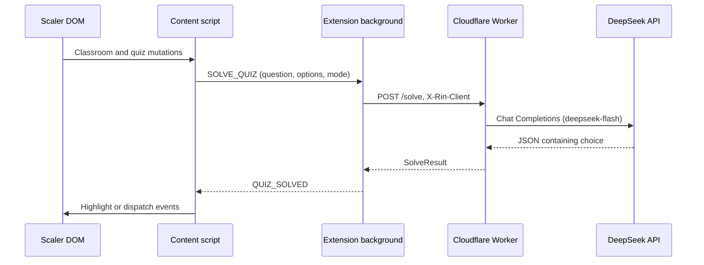

# Rin — System implementation reference

- **Original design date:** 2026-09-25
- **Reconciled with source:** 2026-10-07
- **Version:** 0.2.2
- **Status:** Current implementation reference

This document describes the code in this checkout. It replaces the original proposal's unimplemented benchmark tooling, fixture collection, confidence field, and performance targets with the current contracts and behavior. The [README](../../../README.md) covers setup; [BUILD.md](../../../BUILD.md) covers artifacts; the [extension reference](2026-10-02-extension-architecture-refactor-design.md) describes individual extension modules.

## 1. Product behavior

Rin assists with multiple-choice quizzes on Scaler's Drona classroom UI. It extracts rendered text, obtains a model recommendation, and either highlights the option or dispatches a synthetic click sequence. Defaults are `enabled: true`, `actorMode: 'assisted'`, and `solverMode: 'fast'`.

Execution modes:
- **Assisted mode (default):** sets a purple background and outline on an existing choice element. The student selects the answer.
- **Auto mode:** dispatches synthetic pointer and mouse events to that element; there is no separate submission request or acceptance check.

Solver modes:
- **Fast mode (default):** low-latency direct answering using `deepseek-flash` with thinking mode disabled and a 128-token budget.
- **Reasoning mode:** deep analytical reasoning using `deepseek-flash` with thinking mode enabled and a 4096-token deliberation budget.

Rin does not display model reasoning, report confidence, inspect quiz timers, or measure answer accuracy.

## 2. Packages and execution boundaries

| Package | Source and responsibility |
|---|---|
| `@rin/extension` | `packages/extension/src`: WXT content script, background, popup, and domain modules. |
| `@rin/worker` | `packages/worker/src`: Cloudflare HTTP handler, DeepSeek client, prompt, and parser. |
| `@rin/shared` | `packages/shared/src`: TypeScript contracts and `X-Rin-Client` header constant. |

DOM references stay in the content script. The background performs the worker HTTP request. The worker holds the upstream API key and calls the official DeepSeek API (`https://api.deepseek.com/chat/completions`). There is no database, account service, provider registry, offline solver, or benchmark CLI in this checkout.



## 3. Classroom and quiz lifecycle

The content script matches `*://*.scaler.com/*` and `*://scaler.com/*`, runs at `document_idle`, and sets `allFrames: true`. It loads local settings and installs storage subscriptions even outside classrooms or while disabled.

`MeetingWatcher.start()` queries for `.m-activity` in production. Development uses `.m-activity, .vp-container`, adding recorded-player support. An existing container is handled immediately. Otherwise a `MutationObserver` observes `#root`, or `body`, with `childList: true, subtree: true` and searches added elements and descendants.

On entry, the mount observer disconnects, the quiz observer starts, and a removal observer watches the classroom's immediate parent. This removal observer uses `childList: true` and enables `subtree` only when the observed parent is `body`. A session therefore normally has two observers: quiz mutations and classroom removal. Observed removal calls `onLeave`, stops quiz observation, cleans up the actor, and re-arms meeting search. `stop()` disconnects the meeting observers without calling `onLeave`.

`QuizObserver.start()` extracts an existing quiz immediately and then continues observing the classroom with `childList: true, subtree: true, characterData: true`. Attribute-only changes are not observed. Each mutation callback attempts extraction and emits only when the quiz element or question differs from the previous emission. `stop()` clears this identity and disconnects the observer. A callback that finds a detached classroom also stops observation.

Removing an ancestor above the observed parent can bypass meeting removal detection. Quiz removal alone does not invoke actor cleanup; cleanup occurs on the next HUD action, actor replacement, disabling, meeting leave, or extension context invalidation.

## 4. Extraction and selectors

All CSS selectors live in `packages/extension/src/dom/selectors.ts`:

| Purpose | Selector |
|---|---|
| Application root | `#root` |
| Live classroom | `.m-activity` |
| Development recorded player | `.vp-container` |
| Quiz root | `div.m-quiz` |
| Quiz title (declared, unused by extraction) | `h1.dark.bold` |
| Question | `.m-problem-description__markdown` |
| Choices list | `.m-problem-choices__list` |
| Choice elements | `.m-problem-choices__list > a.choice` |
| Label / text | `.choice__name` / `.choice__text` |
| Selected choice | `.choice--selected` |

`parseQuestion()` joins the question container's direct child blocks with newlines. `<pre>` blocks and blocks containing `<pre>` retain internal whitespace after outer trimming. Other blocks, including standalone `<code>`, have whitespace normalized. Direct question text is used when there are no child elements. Images are not processed.

`parseOption()` normalizes choice text and uses the rendered label, falling back to A, B, C, etc. by array position. Extraction succeeds with a nonempty question, a nonempty choices list, and **any** option containing text. Other options may still be empty. It records selected-choice presence, `performance.now()`, quiz `outerHTML`, and option element references.

## 5. Data contracts

The serializable contracts are defined in `packages/shared/src/quiz.ts` and `solver.ts`:

```ts
interface QuizChoice {
  label: string;
  text: string;
}

type SolverMode = 'fast' | 'reasoning';

interface QuizInput {
  question: string;
  options: QuizChoice[];
  mode?: SolverMode;
}

interface SolveResult {
  chosenIndex: number;
  chosenLabel: string;
  source: string;
  latencyMs: number;
}

interface WorkerErrorResponse {
  error: string;
}
```

The workflow sends option labels, text, and the selected solver mode. The worker maps its answer by array position. The extension uses a DOM-bound `DetectedOption` extending `QuizChoice` with an index and element reference. Model ID constants are defined once in `packages/shared/src/models.ts` (`DEEPSEEK_MODEL_ID = 'deepseek-flash'`, `DEFAULT_MODEL_ID = DEEPSEEK_MODEL_ID`) and used by the extension and worker.

```ts
interface DetectedOption {
  label: string;
  text: string;
  index: number;
  element: HTMLElement;
}

interface QuizData {
  question: string;
  options: DetectedOption[];
  containerElement: HTMLElement;
  alreadyAnswered: boolean;
  detectedAt: number;
  rawHtml?: string;
}
```

`extractQuiz()` captures optional `rawHtml` only in development; production does not serialize quiz HTML. Actors use `options[chosenIndex].element`. DOM elements, raw HTML, detection time, and page URL are not sent in solver requests.

## 6. Workflow, settings, and actors

`QuizWorkflow.process()` returns early when disabled, when `alreadyAnswered` was true during extraction, or when the current quiz DOM contains `.choice--selected`. The extractor and workflow share `isQuizAnswered()` from `packages/extension/src/quiz/state.ts`. After awaiting the solver, the workflow accepts only `QUIZ_SOLVED`, checks enablement and quiz connectivity, and rereads live selection before invoking the current actor. Any selected option suppresses the action and processed hook, even if it matches the recommendation. There is no asynchronous operation between this final selection check and the actor call. After an actor resolves, the optional `onQuizProcessed` hook runs. Errors are caught and sent to the logger; production has no user-visible solver error UI.

There is no request cancellation on meeting leave, retry, in-flight request serialization, or recheck of quiz text or countdown after inference. The live selected-choice guard protects both assisted and auto modes but does not cancel an already-running inference request. Changing actor mode during inference changes the actor used for the result. Duplicate suppression does not include option content, so partial hydration or failed requests can leave the same quiz without a new solve.

`HudActor` first restores any previous highlight, saves the target's inline CSS, applies `!important` purple backgrounds and a `0 0 0 2px #a855f7` shadow, and makes descendant backgrounds transparent. Cleanup restores the saved inline CSS for the target and descendants. `ClickActor` dispatches `pointerdown`, `mousedown`, `pointerup`, `mouseup`, and `click`; its cleanup is a no-op. Both actors return without throwing when the target index is absent.

`ConfigStore` merges `rinConfig` from `browser.storage.local` over defaults (`enabled: true`, `actorMode: 'assisted'`, `solverMode: 'fast'`), falls back to defaults on read failure, and publishes local storage changes. `save()` awaits storage before replacing its cache and rethrows write errors. `load()` and `get()` expose mutable cached objects, so caller mutations can precede persistence. The popup mutates its loaded object, provides button groups to toggle actor mode (`assisted` vs `auto`) and solver mode (`fast` vs `reasoning`), updates UI state, and persists via `configStore.save()`.

## 7. Extension messaging and HTTP client

| Message | Background behavior | Success response |
|---|---|---|
| `SOLVE_QUIZ` | Forwards the payload (`question`, `options`, `mode`) to `WorkerClient.solve()`. | `QUIZ_SOLVED` with `SolveResult` |
| `LOG` | Calls `prettyPrintLog`. | `ACK` |

`MessageRouter.register()` infers each payload type from the message name. `listen()` attaches the runtime listener itself, returns false for unknown/missing types, and keeps recognized message channels open with `true`. Synchronous exceptions and rejected handlers become `ERROR` responses containing a message. Sender identity and payload structure are not validated at runtime.

`WorkerClient` defaults to `https://rin-worker.pujankhunt.me/solve` and uses `AbortSignal.timeout(12000)`. It sends JSON with `Content-Type` and `X-Rin-Client`; the browser manages the Origin header. A constructor key overrides the build-injected key, and missing keys throw. Non-success JSON responses become errors with HTTP status and the worker's message. Success JSON is cast to `SolveResult` without runtime validation. The twelve-second abort limits the extension request; the worker independently aborts its DeepSeek request after ten seconds. Extension disconnection does not explicitly cancel upstream work.

## 8. Worker request handling

The intended endpoint is `POST /solve`; the handler branches on method and **does not check the URL path**.

1. `OPTIONS` checks Origin and returns 204 or 403 without authenticating the client key.
2. Other methods except `POST` return 405.
3. `POST` requires a valid serialized Origin: `chrome-extension://` with a 32-character `a`–`p` ID, `moz-extension://` with a UUID hostname, or HTTP with hostname exactly `localhost` or `127.0.0.1` and an optional port. Missing or rejected origins return 403.
4. Missing/blank `RIN_CLIENT_KEY` or `DEEPSEEK_API_KEY` configuration returns 500. A missing/mismatched `X-Rin-Client` header returns 401.
5. Parsed input must conform to `QuizInput`: nonblank string question, nonempty options array, and valid optional `mode` (`'fast'` or `'reasoning'`). Failed validation returns 400.
6. Solving succeeds with 200 and `SolveResult`. DeepSeek timeouts return 504 and `{ error: message }`. Other JSON decoding, upstream, and answer parsing exceptions return 500 with the same error shape.

CORS reflects an accepted Origin, otherwise uses `null`, allows `POST, OPTIONS` and `Content-Type, X-Rin-Client`, and sets `Vary: Origin`. Origin validation parses the URL, rejects credentials and resource URL components, and validates hostnames. Extension ID format is checked without a specific extension allowlist. The shared client key is embedded in the extension and there is no application-level rate limit.

`DEEPSEEK_API_KEY` stays on the worker. `wrangler.jsonc` names the worker `rin-solver`, uses compatibility date `2026-09-20`, configures the custom domain, and enables persisted invocation logs and traces at sampling rate 1.

## 9. Prompt, parsing, and timing

`solve()` builds the chat completion payload via `buildChatPayload(quiz)` using model `deepseek-flash`:
- **Fast mode (`mode: 'fast'`, default):** Uses `FAST_MODE_SYSTEM_PROMPT`, user prompt suffix `Respond with a JSON object containing "choice".`, `max_tokens: 128`, `thinking: { type: 'disabled' }`, and `temperature: 0`.
- **Reasoning mode (`mode: 'reasoning'`):** Uses `REASONING_MODE_SYSTEM_PROMPT`, user prompt suffix `Respond with a JSON object containing "choice" and "reasoning".`, `max_tokens: 4096`, `thinking: { type: 'enabled' }`, and `temperature: 0`.

`DeepSeekClient.complete()` posts to `https://api.deepseek.com/chat/completions` with bearer authentication and reads `choices[0].message.content`. Its abort controller limits both the fetch and response-body read to 10,000 milliseconds (`DeepSeekTimeoutError` and HTTP 504). If content is empty (even when `reasoning_content` is present), it logs `INFERENCE_EMPTY_CONTENT` and throws. Non-success upstream responses throw with the HTTP status. The timer is cleared after completion or error.

`parseQuizChoice()` strips optional Markdown fences, parses JSON, requires a nonblank string `choice`, and matches labels case-insensitively. Malformed or unknown choices throw; there is no guessed fallback. Reasoning is not returned to the extension.

`latencyMs` is the rounded worker duration from before prompt construction through upstream inference and answer parsing. It excludes extension-to-worker transport, authentication/body decoding, and browser actions. No measured latency, accuracy, cost, or provider benchmark guarantee is included in this implementation.

## 10. Diagnostics and verification

Development logging is printed in the background context or forwarded there from content/popup contexts. Normal logger calls return without emitting in production; the background's registered `LOG` route still invokes the printer when directly called.

The development workflow hook records quiz metadata, isolated quiz HTML, and the current `#root` HTML (with `body` fallback) **after** an actor resolves. It stores snapshots in `rinSnapshots`, retaining at most 20 newest entries and 2 MiB of serialized UTF-8 data. Oldest entries are evicted first and a snapshot too large to fit is not retained. Storage errors are swallowed. Manual `Alt+Shift+S` or `Ctrl+Alt+S` snapshots also download HTML using a Blob and temporary anchor. These diagnostics are enabled by the development entrypoint, not by the recorder functions themselves.

`pnpm test` runs Vitest across extension and worker tests. Browser APIs and network calls are mocked and DOM behavior uses JSDOM; `pnpm typecheck` checks all three packages. The two root-level HTML captures document a live `.m-activity` with an already-selected choice; tests use inline fixtures rather than loading these captures. There is no automated live-browser submission test or benchmark script. Build commands and artifact checks are documented in [BUILD.md](../../../BUILD.md).
